# Linux
### Setting up the virtual machine on-premises
### Add additional storage
* Right click on vm -->Removable disk -->CD/DVD(IDE) -->settings --> Add --> hard disk--> create new virtual disk--> store virtual disk as a single file.
  
  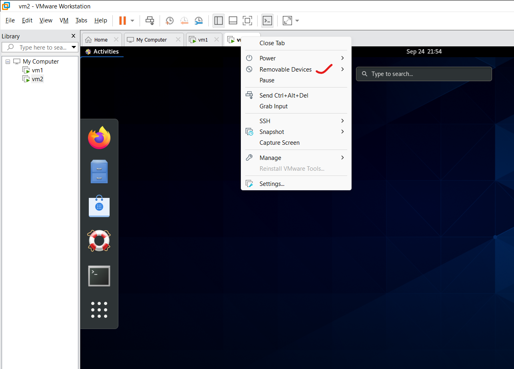
  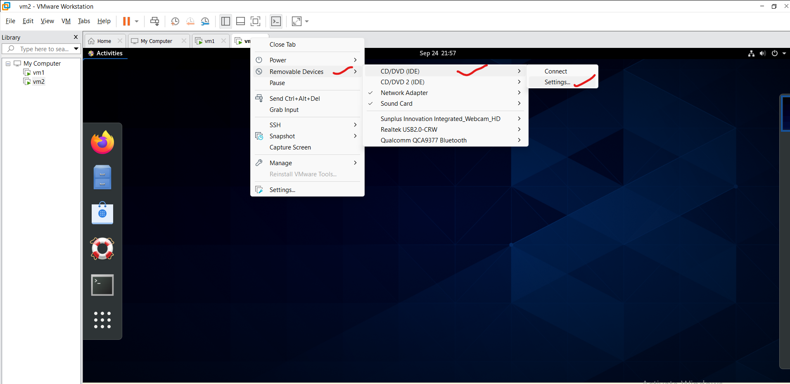
  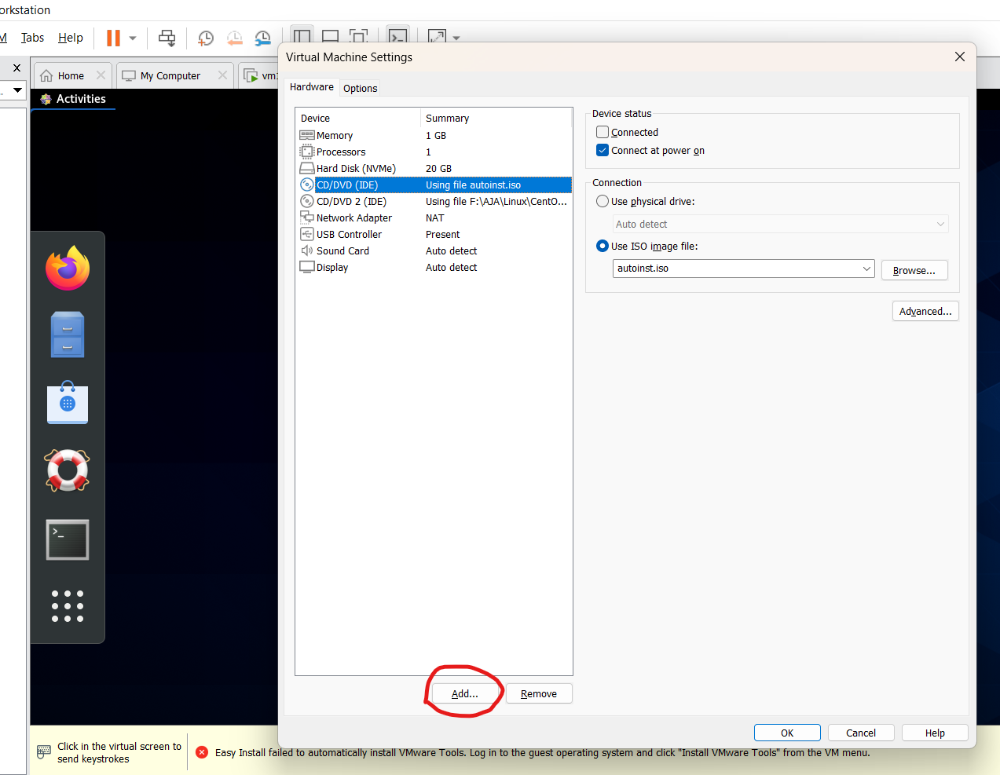
  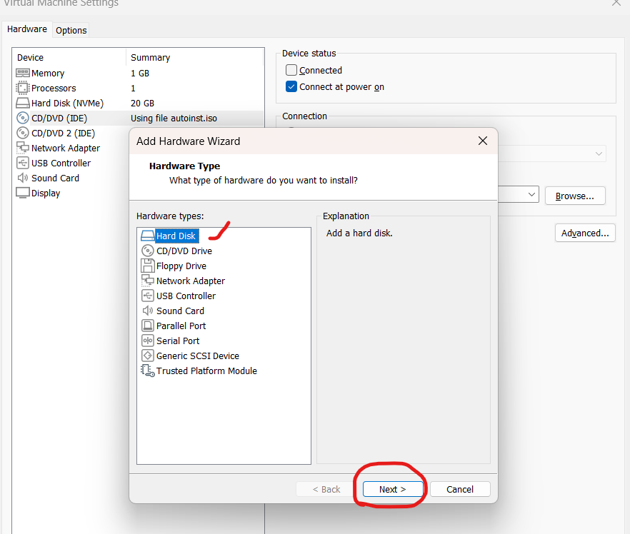
  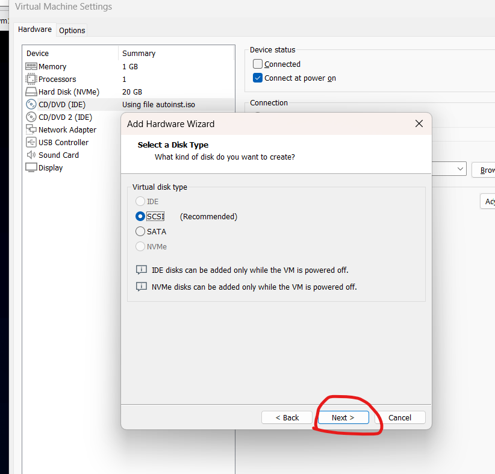
  
  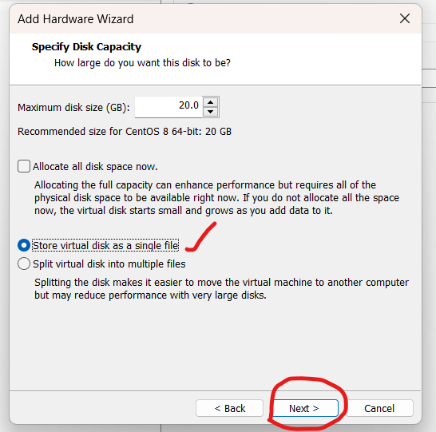
  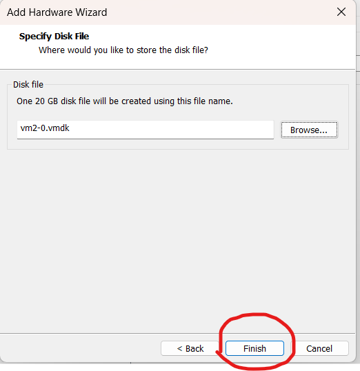
  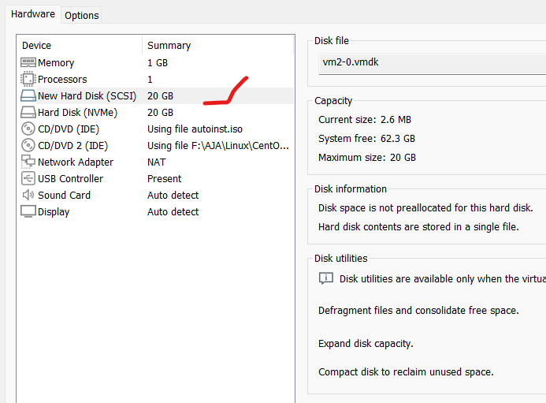

* Select CD/DVD(IDE) in settings --> use ISO image file -->(Browse the image which you have used to create the vm)--> ok
  
  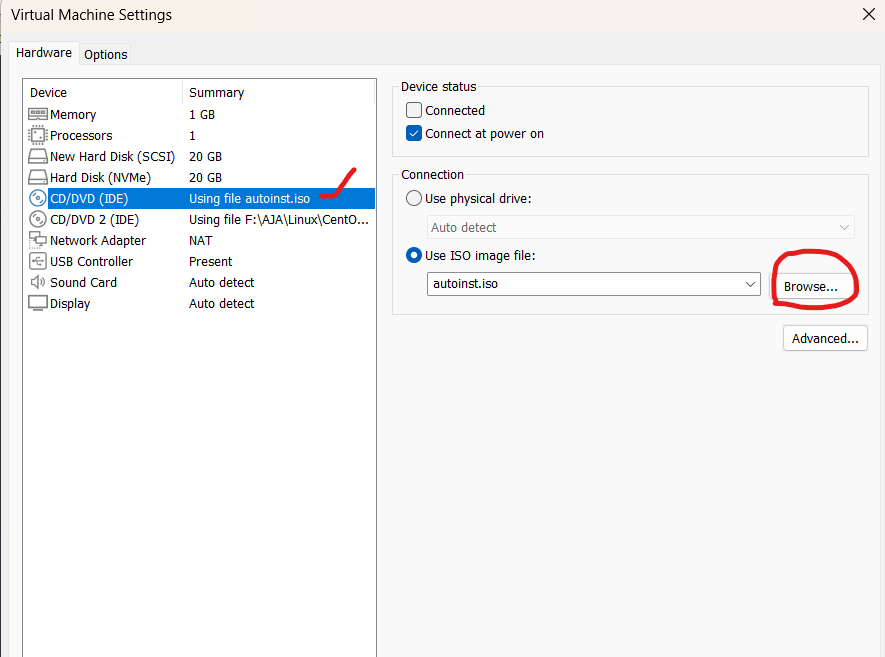
  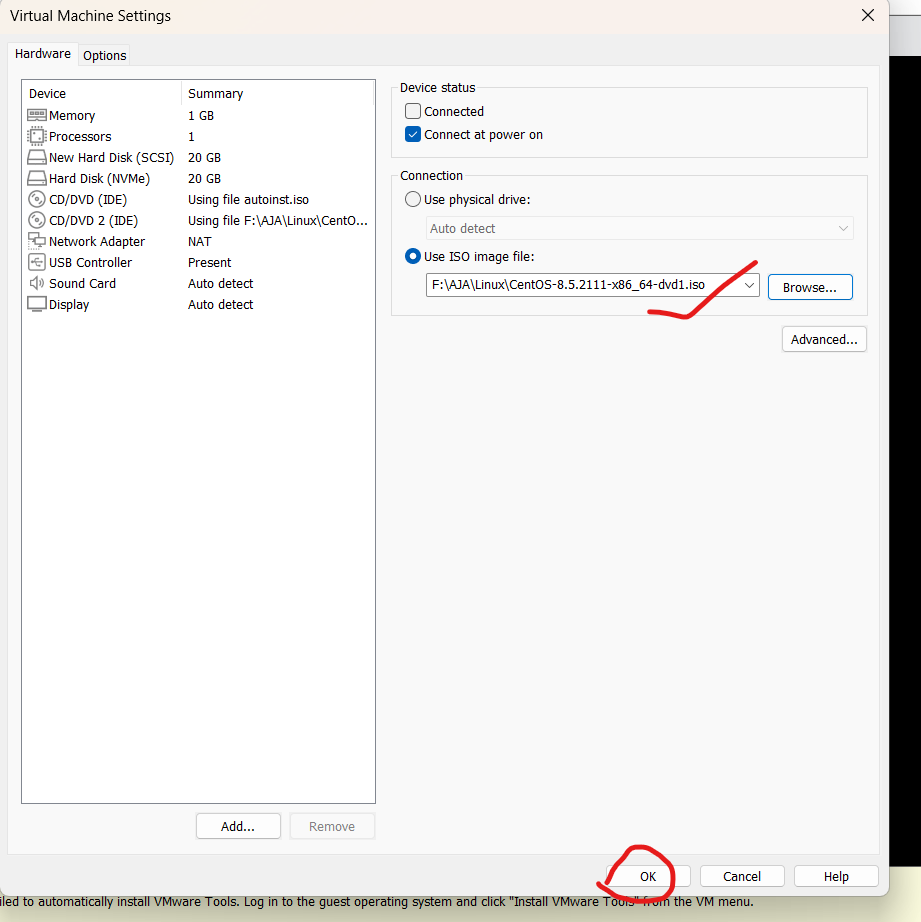

* Removable disk -->CD/DVD(IDE) --> connect.
  
  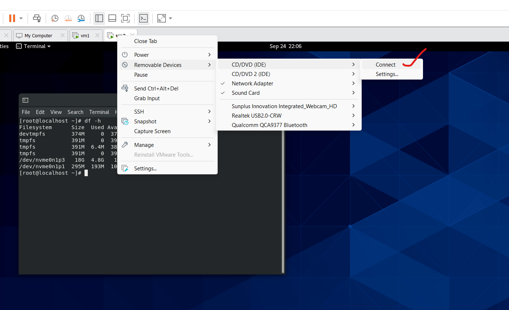

* Check if the disk is connected or not.
  
  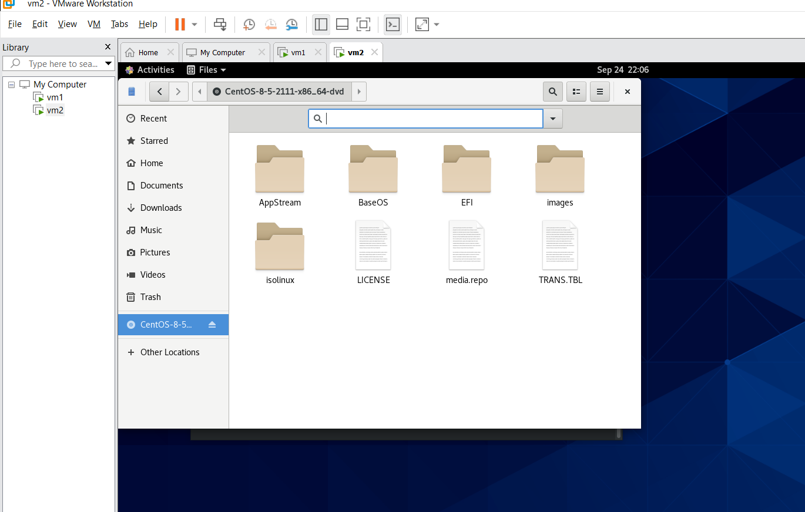
  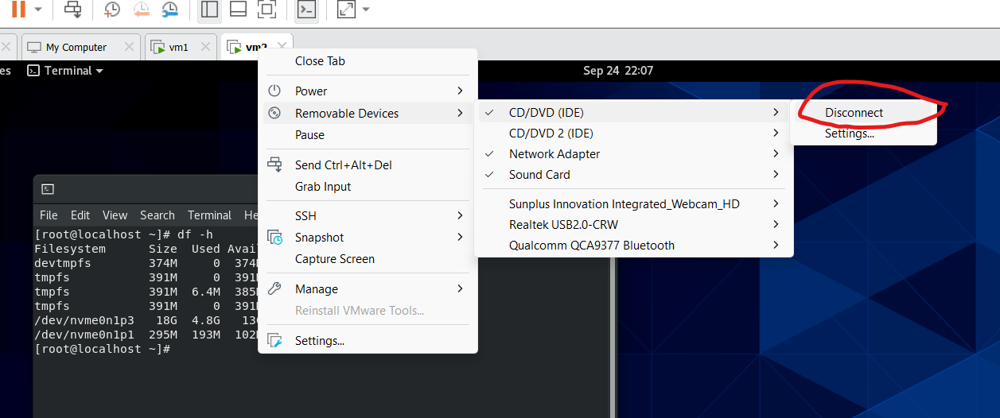

* Now disk is successfully connected. Below image is before and after connecting the disk.
  
  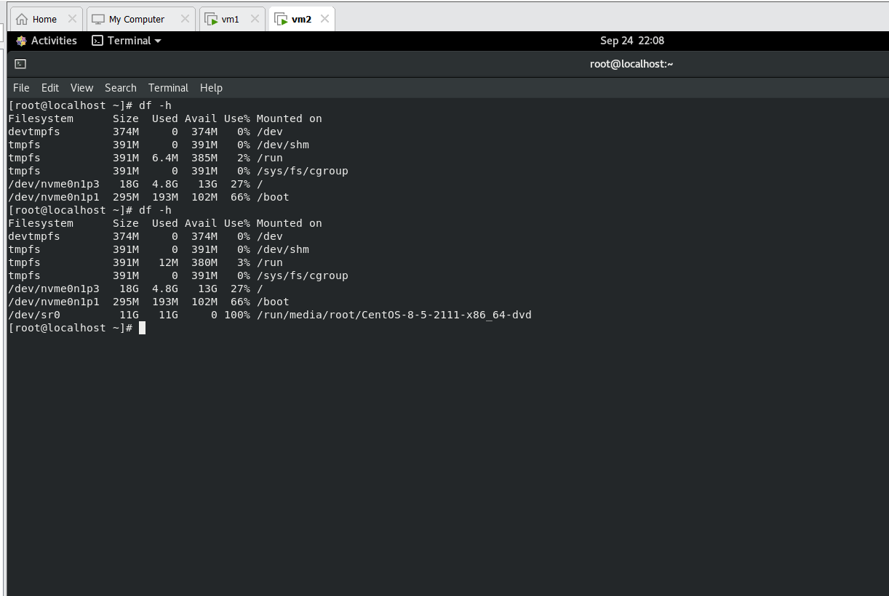

### Connect with your windows terminal/powershell:
* If we give cmd `ip a` we get the ip address of vm.
  
  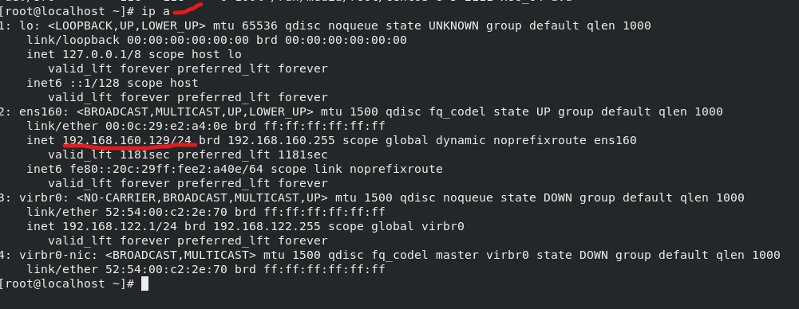

* Note that if address and in your windows terminal enter this command `ssh root@192.168.160.129 -22`
  
  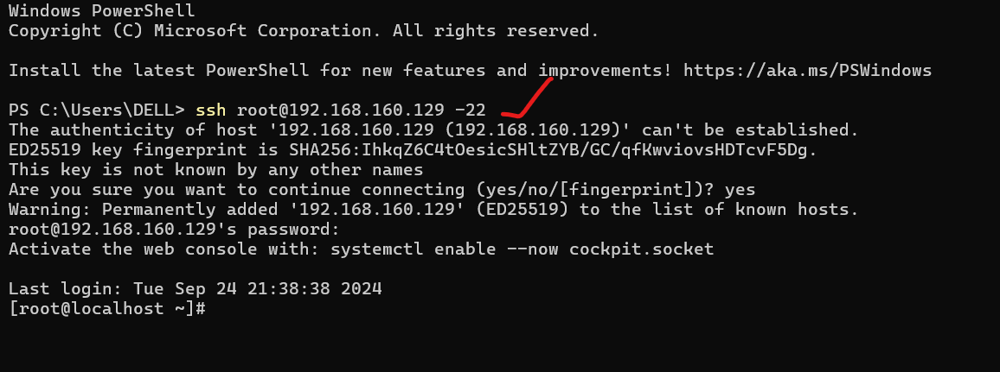

### To change the hostname:
* We have two options:
    1. `vi /etc/hostname ` --> Edit the old name and give new name and then save.
    2. `hostnamectl set-hostname <new_hostname>`, then exit and login again.
   
   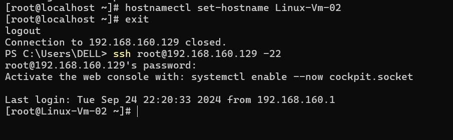

### Commands
* Run the below commands to setup repositories so that we can download the packages.
```shell
# sed is a command to find and replace anything
# Update mirroelist under the /etc/yum.repos.d
sed -i 's/mirrorlist/#mirrorlist/g' /etc/yum.repos.d/CentOS-Linux-*
sed -i 's|#baseurl=http://mirror.centos.org|baseurl=http://vault.centos.org|g' /etc/yum.repos.d/CentOS-Linux-*
 
# Update the baseOS and appstream
vim /etc/yum.repos.d/local.repo # add the below lines
 
[InstallMedia-BaseOS]
name=CentOS Linux 8 - BaseOS
metadata_expire=-1
gpgcheck=1
enabled=1
baseurl=file:////run/media/root/CentOS-8-5-2111-x86_64-dvd/BaseOS/
gpgkey=file:///etc/pki/rpm-gpg/RPM-GPG-KEY-centosofficial
 
[InstallMedia-AppStream]
name=CentOS Linux 8 - AppStream
metadata_expire=-1
gpgcheck=1
enabled=1
baseurl=file:////run/media/root/CentOS-8-5-2111-x86_64-dvd/AppStream/
gpgkey=file:///etc/pki/rpm-gpg/RPM-GPG-KEY-centosofficial

# mysql.repo is used to download the mysql repositories 
vim /etc/yum.repos.d/mysql.repo #add the following lines

[mysql57-community]
name=MySQL 5.7 Community Server
baseurl=http://repo.mysql.com/yum/mysql-5.7-community/el/6/$basearch/
enabled=1
gpgcheck=1
gpgkey=file:///etc/pki/rpm-gpg/RPM-GPG-KEY-mysql-2022
 
```
* Now you can download you can able to download.

    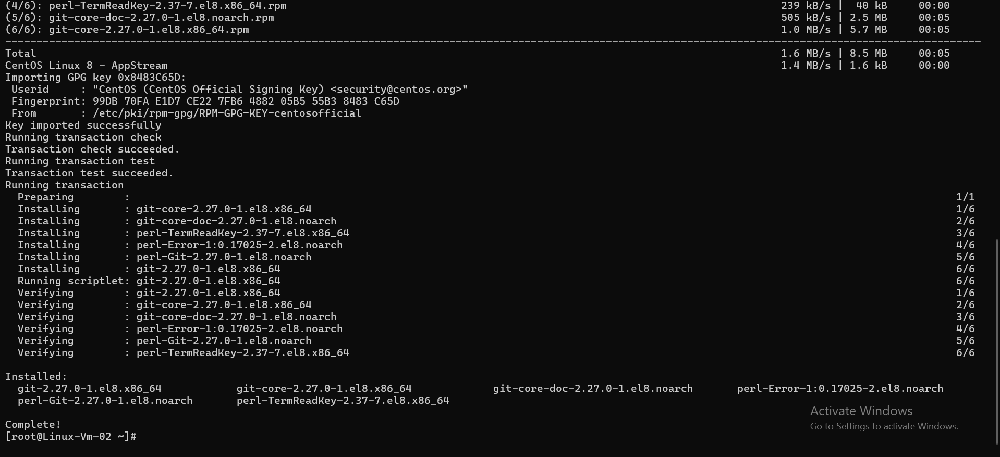

### Basic Linux Commands
* `cal`: Prints month calender.
* `cal -y`: Prints year calender.
* `touch file.txt`: To create a file.
* `touch file{1..10}.txt`: To create multiple files with single cmd.
* `mkdir folder`: To create a directory.
* `mkdir folder{1..10}`: To create multiple directories at once.
* `rm file.txt`: To delete a file.
* `rm file{1..10}.txt`: To delete multiple files at onces.
* `rmdir folder`: To delete the directory.
* `rmdir folder{1..10}`: To delete multiple directories at once.
* `rm -rf`: To delete file and folder at a time. `r` --> `recurssive` and `f` -->`force`
* `echo`: To print the content that you have given.
* `echo hi > file.txt`: This will write the `hi` in `file.txt`
  
* **Wildcards in linux**
1. `*` means everything. ``rm -rf *` --> Deletes everything
2. `?` means single position.
3. `[]` means

* **`cat` command**
* `cat`: Used to read,write and concatenate the content in a file.
* `cat file.txt`: to read the content in the file.
* `cat >file.txt`: To write the content to the file. 
* `cat >file.txt`: To add content to the file. `>` will always overwrites the data. `>>` will add to the previous data.
* After above command is write click `enter` and write the content, click `enter` and `ctrl +c` then the content will be saved.
* `cat file1 file2 > file3`: USed to concatenate the content of two files into other file.
  
  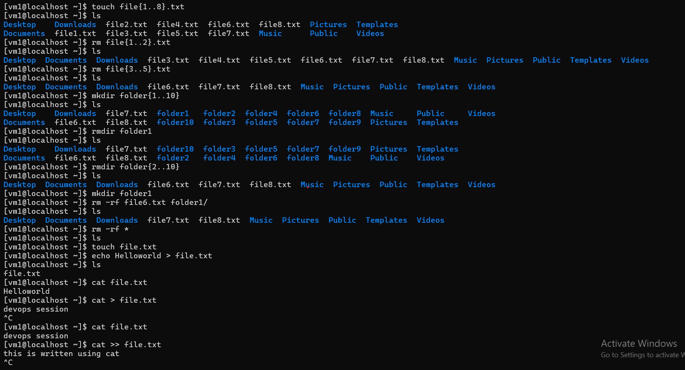
  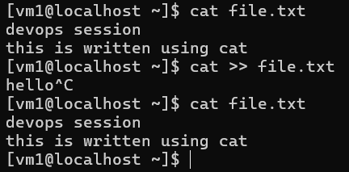

* To create a file using `cat` 
  
  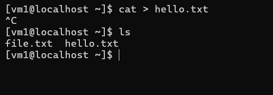

* Concatenate 
  
  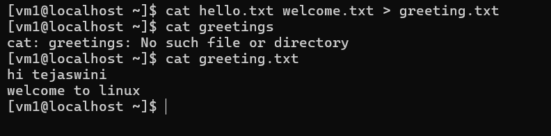
  
* **Editors**
  1. `nano`:In unix we have pico editor, so in linux we gave nano.
        * edit the file.
        * to save `ctrl+o` --> `enter`--> `ctrl+x` --> `y`
  2. `vi`: latest and preferably used.
  3. `vim`: `vi` and `vim` both are same. belongs to same family. 
        * `i` to insert. 
        * `esc` to exit from edit mode.
        * `:wq` to save.
        * `q!` to quit without editing.
* `cp`: to copy files from one directory to other.
* `mv`L to cut and paste or rename file name.
   
   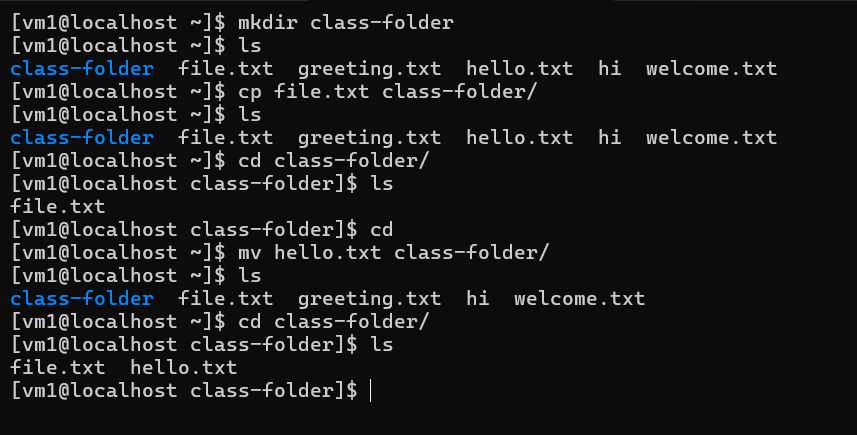
   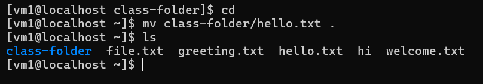

#### Compress files
* If we have more files, to move them to other directory or backup them it will take more time to do individually. So if we compress them to single file then it will be easy.
* In linux we have `tar` to compress files.
* `tar` will create `tarball` (compressed file)
* To create `tarball` cmd is `tar -cvf <tar_filename> <file>` then `.tar` file will be created. `c`--> create, `v` --> virbose. `f` --> force.
* How do I knw if the file is in that `.tar` file or not?
```shell
tar -tf <tar_filename>
# this command will display the files in .tar file
```
* If you want to add additional files to the pervious `.tar`file. `tar -rf <tar_filename> <file1> <file2> <file3>`
* Size of the `tar` file is not reduced. To reduce the size of that we have to `zip` it.
* Two types of zip:
    1. `gzip`: 
         * cmd to zip `gzip <tar_filename>` then gzip file is created.
         * To unzip the file then `gunzip <gzip_filename>`
    2. `bzip2`:
        * cmd to zip `bzip2 <tar_filename>` the bzip2 file is created.
        * To unzip the file then `bzip2 <bzip2_filename>` 
* compressed file in zip formate size of gzip file (nearly 90% is reduced compared with tar file) is less compared to bzip2 file. 
* Now we can move tar file (single file which contains all the files) to any location easily.
* To extract the `tar` file. `tar -xf <tar_filename> <filename>` (To extract particular file)
* To extract all files`tar -xf <tar-filename>`
* After extraction files will be present in tar file and outside of tar file too. So that even we loss the files we have backup in tarfile.
  
### File Permissions
* `r` --> Read=`4`
* `w` --> Write=`2`
* `x` --> Execute=`1`
* The above permissions are given to user, group and others(other users)
* `-rw-r--r--`: 
    1. In this first one indicates `file` or `directory`
    2. next 3 places are for user.
    3. After user, Next 3 places are for group.
    4. After group, Next 3 places are for other.

* `chmod`: this command is used to change the file permission to user, group and other.
```bash
chmod 421 file # user--> read, group -->write, other --> execute permission are allocated
chmod 750 file # user--> read,write and execute, group -->write and execute, other --> none permission are allocated
```
### Difference between scripting and coding
* `Scripting` --> Used for automation
* `coding` --> used to create something.
* If we have a task to perform on daily bases instead of running indivial commands we write all the commands in a scripting file and we cand do automate to run those cmd all at once using `crontab` or `scheduler`

## On-premises Application Deployment
* Any application will have 3 layers or tiers.
    1. Presentation layer: Client will see and select the product
    2. Application layer/logic tier: collect and process the data from client
    3. database layer: stores the data in databases.
* Vm-1 --> Used as webserver and application server
* Vm-2 --> used as  db layer.
  
### Steps to run the application on on-premises on Vm-1:
```bash
yum install mariadb-devel gcc* redhat-rpm-config python3-devel -y
# devel --> contains the package with all the files extension modules
```
* Now create a folder for app1 in `/`
```bash
mkdir /app1
cd /app1
vi main.py 
```
  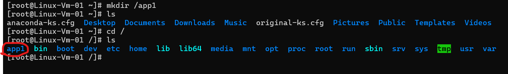

* copy the below code and paste it in main.py
```python
from flask import Flask
app = Flask(__name__)

@app.route("/app1")
def hello():
    return "Hello from App1"
```
* To run the code we need to install flask.
```bash
pip3 install flask
```
  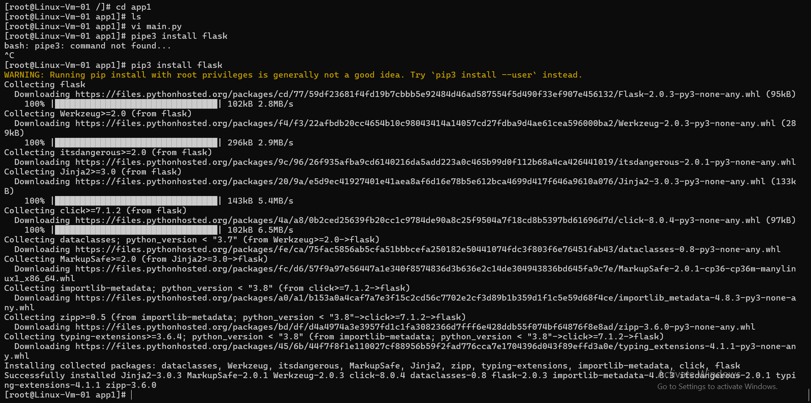

* `main.py` should contain the only code where end user will be accessing. Exposinf the application should be presentin different file.
* To expose the application we are using **web server gateway interfave(wsgi) server** runs pythn code to create a web application.
* Create a wsgi.py file. `vi wsgi.py` and paste the below file
* Defined on what port I want to expose the application.
```python
from main import app as application
app=application

if __name__ == '__main__':
    app.run(host='0.0.0.0',port=5001)
```
* To run wsgi server, we have to download **green unicorn or gunicorn**. It is a python wsgi http server. `pip3 install gunicorn`.
  
  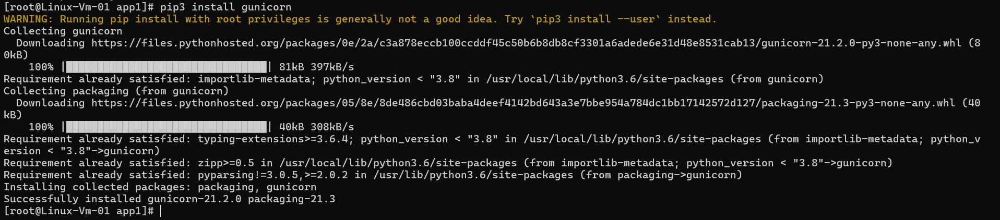

* Now run wsgi where main.py will automatically trigger. `gunicorn wsgi`
  
  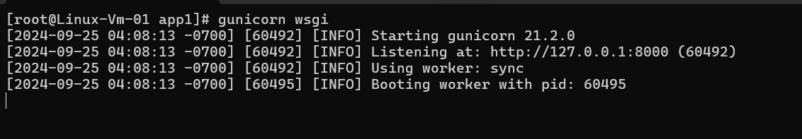

* By default gunicorn runs on `8000` port. But our application should run on `5001`.
* For that we have to bind the `5001` port.
```bash
gunicorn --bind=0.0.0.0:5001 wsgi
# saying that wsgi should run on 5001 port
```
  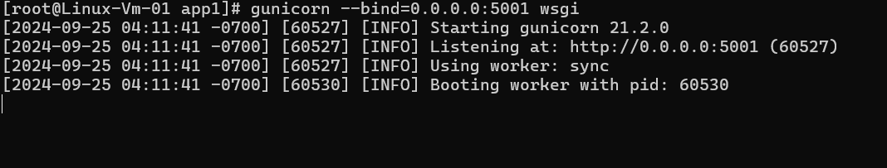

* We can't reach the application because we didn't open `5001`.
  
  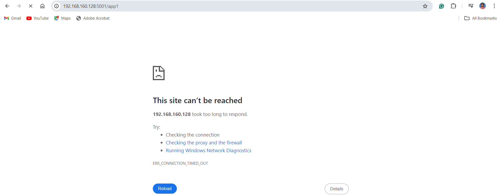

* `netstat -ntpl` --> will show which ports are open currently.
  
  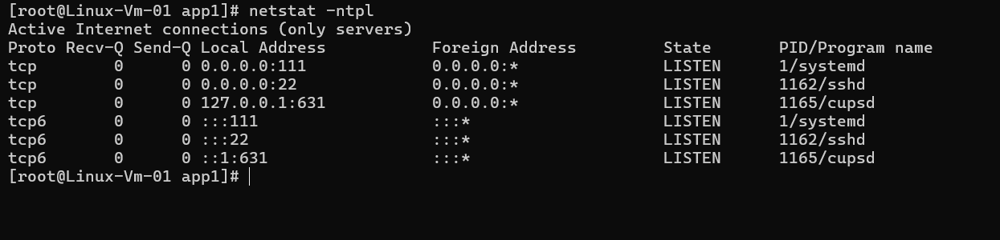

* To open ports on cloud we have `security groups`. For on-premises we have `firewall` --> this service will act as security.
* Command to open `5001` port is `firewall-cmd --zone=public --add-port=500/tcp --permanent`. After that cmd is runned we have to reload the firewall service. `firewall-cmd --reload`.
  
  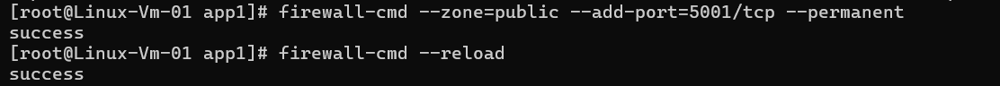

* Now again run the above cmd  `gunicorn --bind=0.0.0.0:5001 wsgi` 
  
  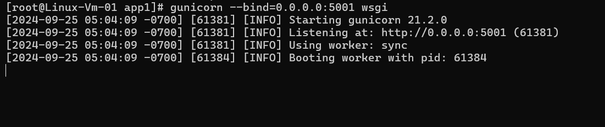
  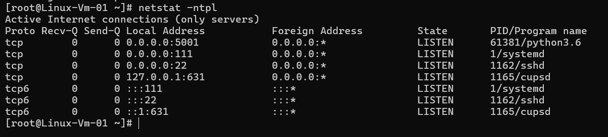
  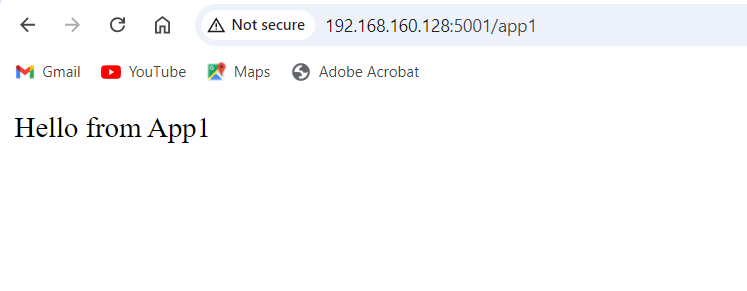

* `gunicorn` is running as frondend service and not giving access to the terminal. If we stop `gunicorn`, application will stop running.
  
  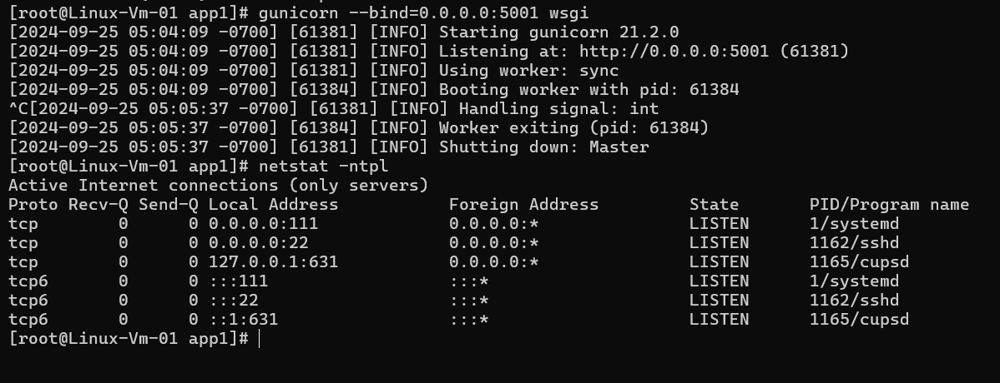
  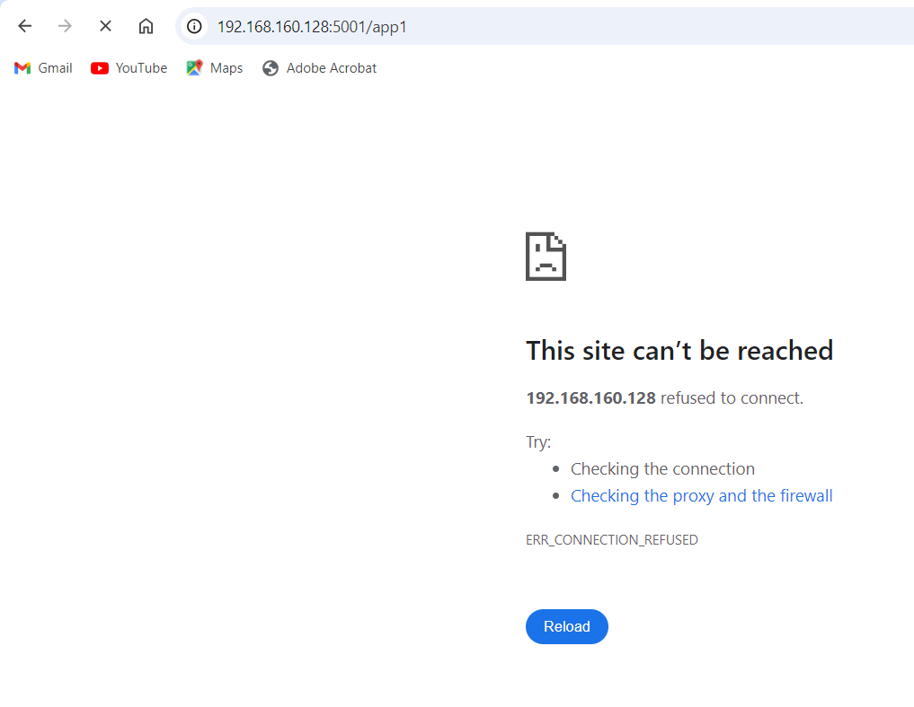

* So I want to run that as backend service. In order to do that we have to create a `.service` file.

```bash
cd /etc/systemd/system
vi app1.service 

[Unit]
Description=gunicorn daemon
After=network.target

[Service]
User=root
Group=root
WorkingDirectory=/app1
ExecStart=gunicorn --access-logfile='app1.log'  --bind=0.0.0.0:5001  wsgi

[Install]
WantedBy=multi-user.target

systemctl start app1
systemctl status app1
```
  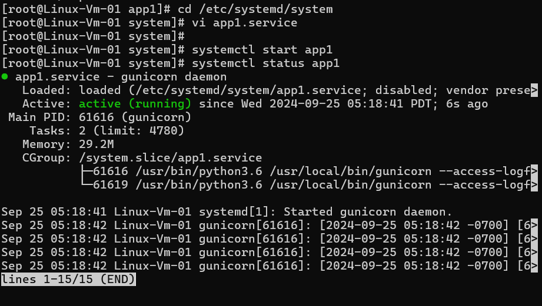

* Our application is running in backend successfully.
  
  
  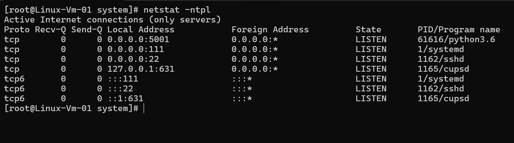

* Do the same process on Vm-02.

```bash
mkdir /app2
cd /app2/
vi main.py
vi wsgi.py
cat main.py
pip3 install flask
pip3 install gunicorn
gunicorn wsgi
gunicorn --bind=0.0.0.0:5000 wsgi
firewall-cmd --zone=public --add-port=5000/tcp --permanent
firewall-cmd --reload
cd /etc/systemd/system/
vi app2.service
systemctl start app2
systemctl status app2
netstat -ntpl
```
* **app2.py**
```python
from flask import Flask
app = Flask(__name__)

@app.route("/app2")
def hello():
    return "Hello from App2"
```
* **wsgi.py**
```python
from main import app as application
app=application

if __name__ == '__main__':
    app.run(host='0.0.0.0',port=5000)
```
* **app2.service**
```bash
[Unit]
Description=gunicorn daemon
After=network.target

[Service]
User=root
Group=root
WorkingDirectory=/app2
ExecStart=gunicorn --access-logfile='app2.log'  --bind=0.0.0.0:5000  wsgi

[Install]
WantedBy=multi-user.target
```

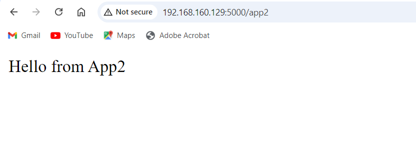

### Configuring LoadBalancer
* Ratherthan using two different ip addresses we can use same ip address and change the paths for different services of an application.
* We can achive this using nginx as Application loadbalancer on webserver.
* In **Vm-01** do the following steps:
```bash
yum install nginx -y
firewall-cmd --zone=public --add-port=80.tcp --permanent
systemctl start nginx
systemctl status nginx
```
  
  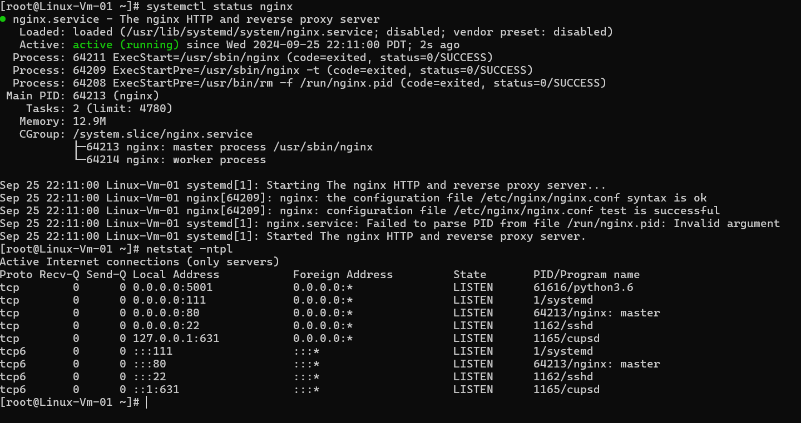
  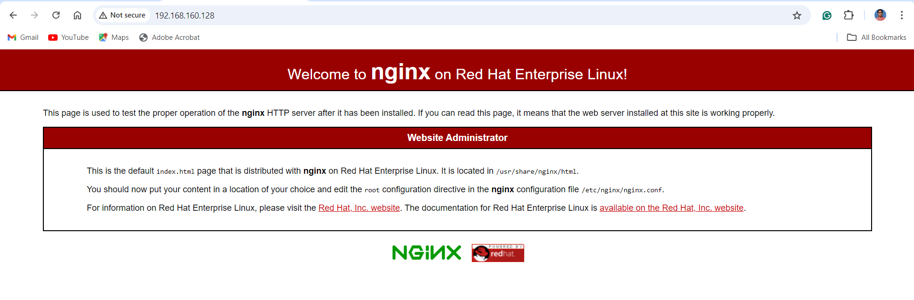

* Now edit the nginx.config file 
```bash
vi /etc/nginx/nginx.config
# For more information on configuration, see:
#   * Official English Documentation: http://nginx.org/en/docs/
#   * Official Russian Documentation: http://nginx.org/ru/docs/

user nginx;
worker_processes auto;
error_log /var/log/nginx/error.log;
pid /run/nginx.pid;

# Load dynamic modules. See /usr/share/doc/nginx/README.dynamic.
include /usr/share/nginx/modules/*.conf;

events {
    worker_connections 1024;
}

http {
    log_format  main  '$remote_addr - $remote_user [$time_local] "$request" '
                      '$status $body_bytes_sent "$http_referer" '
                      '"$http_user_agent" "$http_x_forwarded_for"';

    access_log  /var/log/nginx/access.log  main;

    sendfile            on;
    tcp_nopush          on;
    tcp_nodelay         on;
    keepalive_timeout   65;
    types_hash_max_size 2048;

    include             /etc/nginx/mime.types;
    default_type        application/octet-stream;

    # Load modular configuration files from the /etc/nginx/conf.d directory.
    # See http://nginx.org/en/docs/ngx_core_module.html#include
    # for more information.
    include /etc/nginx/conf.d/*.conf;


    server {
listen 80;
server_name 192.168.160.128 ;
location /app2 {

        proxy_set_header Host $http_host;
        proxy_set_header X-Real-IP $remote_addr;
        proxy_set_header X-Forwarded-For $proxy_add_x_forwarded_for;
        proxy_set_header X-Forwarded-Proto $scheme;

        #proxy_pass http://unix:/app/app.sock;
        proxy_pass http://192.168.160.129:5000;   
        }
location /app1 {

        proxy_set_header Host $http_host;
        proxy_set_header X-Real-IP $remote_addr;
        proxy_set_header X-Forwarded-For $proxy_add_x_forwarded_for;
        proxy_set_header X-Forwarded-Proto $scheme;

        #proxy_pass http://unix:/app/app.sock;
        proxy_pass http://192.168.160.128:5001;   
        }
}
    #server {
    #    listen       80 default_server;
    #    listen       [::]:80 default_server;
    #    server_name  _;
    #    root         /usr/share/nginx/html;

        # Load configuration files for the default server block.
     #   include /etc/nginx/default.d/*.conf;

      #  location / {
      #  }

       # error_page 404 /404.html;
       #     location = /40x.html {
       # }

        #error_page 500 502 503 504 /50x.html;
        #    location = /50x.html {
        #}
#    }

# Settings for a TLS enabled server.
#
#    server {
#        listen       443 ssl http2 default_server;
#        listen       [::]:443 ssl http2 default_server;
#        server_name  _;
#        root         /usr/share/nginx/html;
#
#        ssl_certificate "/etc/pki/nginx/server.crt";
#        ssl_certificate_key "/etc/pki/nginx/private/server.key";
#        ssl_session_cache shared:SSL:1m;
#        ssl_session_timeout  10m;
#        ssl_ciphers PROFILE=SYSTEM;
#        ssl_prefer_server_ciphers on;
#
#        # Load configuration files for the default server block.
#        include /etc/nginx/default.d/*.conf;
#
#        location / {
#        }
#
#        error_page 404 /404.html;
#            location = /40x.html {
#        }
#
#        error_page 500 502 503 504 /50x.html;
#            location = /50x.html {
#        }
#    }

}
```
* After editing the `nginx.conf` file, Restart the nginx. `systemcl restart nginx`
* Check the application page is running or not. `http://192.168.160.128/app1` or `http://192.168.160.128/app1`
  
  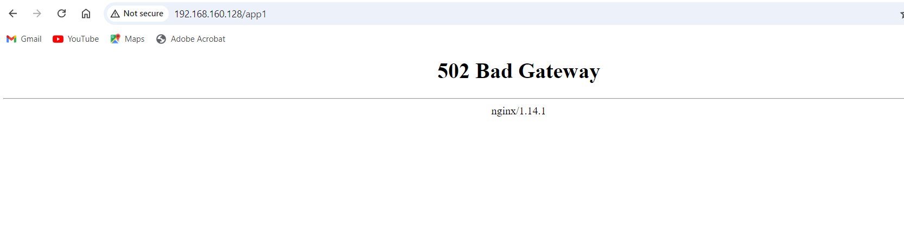

* Our page is still not hitting so we have to check `SELinux`
* `SELinux` (Security-Enhanced Linux) is a security feature in Linux that controls what users and programs can access on the system. It helps protect your system from unauthorized access by enforcing strict rules on what can be done.
* Commands for SELinux,So that we can access the application.
```bash
getenforce
setenforce 0
getenforce
```
  

* After setting enforce we can access the application through single ip address.
  
  
  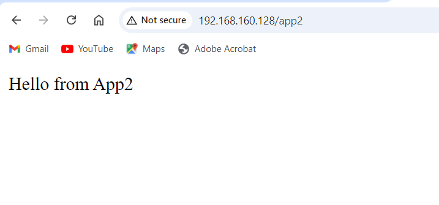

### Setting a DNS for the application.
* Open Notepad (Run as Administrator) --> Files --> Open --> Local disk (C) --> Windows --> System32 --> etc-->hosts
* add ipaddress and dns in last of the hosts file.
  
  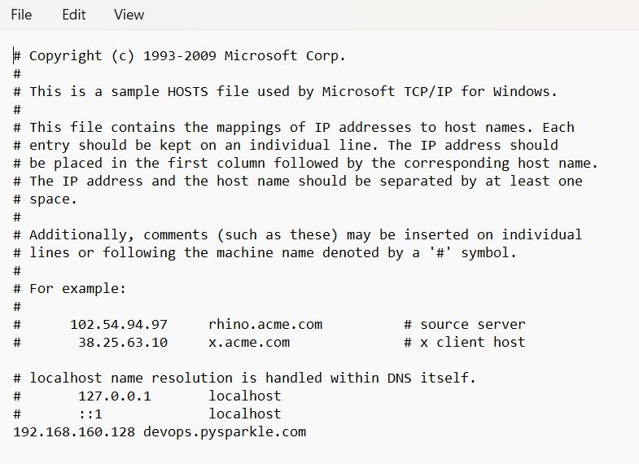

* Now restart the nginx and check the nginx npage with the dns you have given.
  
  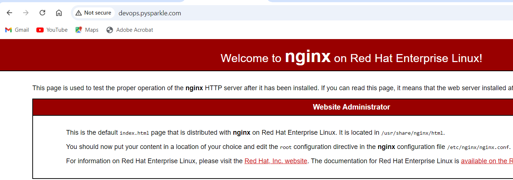
  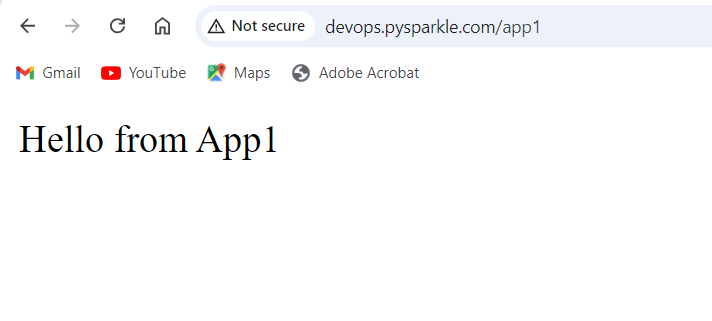
  

### Setting database for our application
* Setup database manually
  * Install
  * Configure
  * Security
* On Vm-02, we will configure database.
#### Steps:
1. Install mysql server
```bash
yum install mysql-server -y
```
2. Now start the mysqldb service.
```bash
service mysqld start
```
3. Now install mysql
```bash
mysql-secure-installation
# Set the password
```
  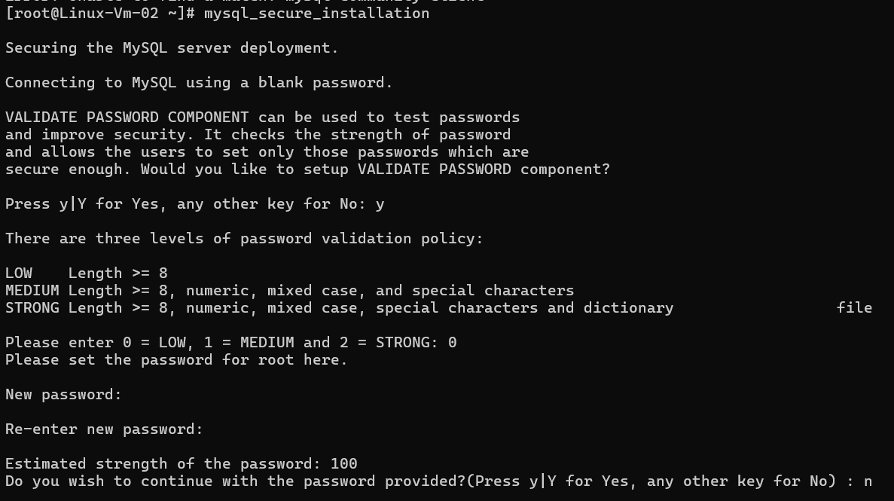

4. Now server is converted to database server.
5. To connect with the database server.
```bash
mysql -u root -p
# Enter the password
```
  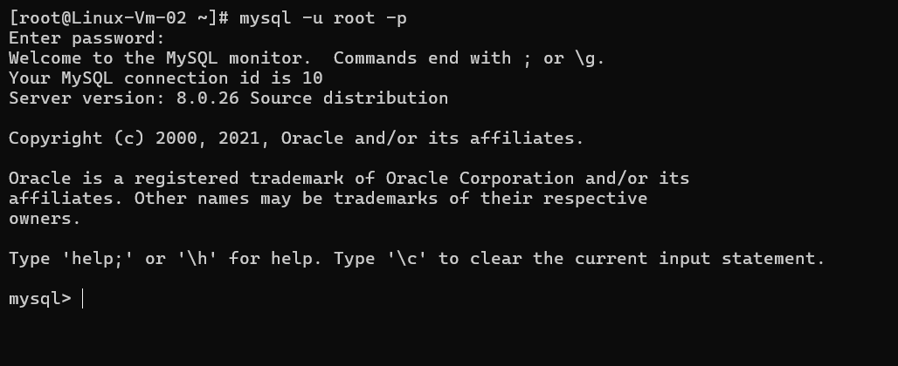

6. Now we are inside the mysql database server.
7. Create a database, table.
```sql
CREATE DATABASE appdata;
USE appdata;
SHOW TABLES;
CREATE TABLE MyUsers(FirstName VARCHAR(30) NOT NULL, LastName VARCHAR(30) NOT NULL);
SHOW TABLES;
```
 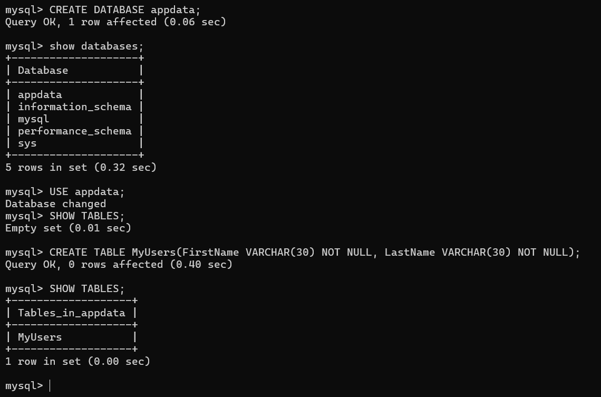

8. Create an user, so that the data form vm-01 would update the data in database using this user.
```sql
CREATE USER 'app1'@'192.168.160.128' IDENTIFIED BY 'app1@123';
``` 
9. For the user we created we should give permissions to update the database.
```sql
GRANT ALL PRIVILEGES ON appdata.* TO 'app1'@'192.168.160.128';
FLUSH PRIVILEGES;
SHOW GRANTS FOR 'app1'@'192.168.160.128';
```
  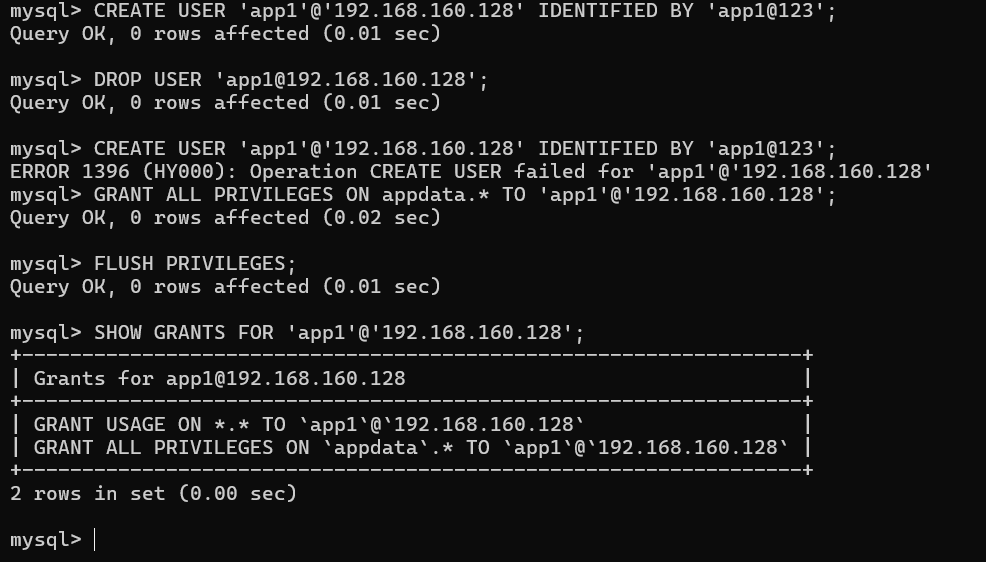

### Integration with database with application server.
#### Steps in Vm-01:
1. In Vm-01, change the code in main.py use below code.

```python
from flask import Flask, render_template, request
from flask_mysqldb import MySQL
app = Flask(__name__, template_folder='/app1/templates/')


app.config['MYSQL_HOST'] = '192.168.160.129'
app.config['MYSQL_USER'] = 'app1'
app.config['MYSQL_PASSWORD'] = 'app1@123'
app.config['MYSQL_DB'] = 'appdata'

mysql = MySQL(app)


@app.route('/app1', methods=['GET', 'POST'])
def index():
    if request.method == "POST":
        details = request.form
        firstName = details['fname']
        lastName = details['lname']
        cur = mysql.connection.cursor()
        cur.execute("INSERT INTO MyUsers (FirstName, LastName) VALUES (%s, %s)", (firstName, lastName))
        mysql.connection.commit()
        cur.close()
        return 'success'
    return render_template('index.html')
```
2. Now create a template directory as we mention that path for html page.
```bash
cd /app1
mkdir templates
cd templates
vi index.html
# enter below code for html page
<HTML>
    <BODY bgcolor="cyan">
    <form method="POST" action="">
        <center>
        <H1>Enter your details </H1> <br>
        First Name <input type = "text" name= "fname" /> <br>
        Last Name <input type = "text" name = "lname" /> <br>
        <input type = "submit">
        </center>
    </form>
    </BODY>
    </HTML>
```
3. To integrate mysql db and flask application we have to install a package.
```bash
pip3 install flask-mysqldb
```
4. Now restart the application
```
systemctl daemon-reload
systemctl restart app1
```


* We could not access the application because we didn't open mysql port in VM-02.
```bash
firewall-cmd --zone=public --add-port=3306/tcp --permanent
firewall-cmd --reload
```
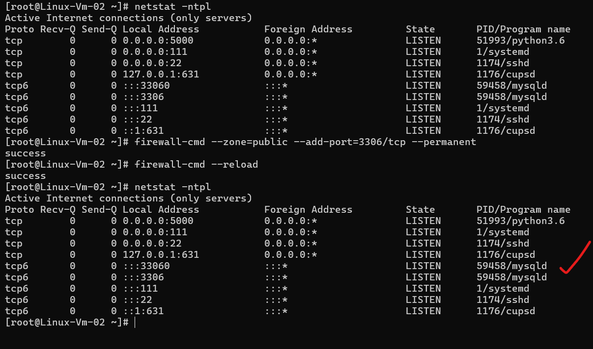

*  Now check the application page
  
  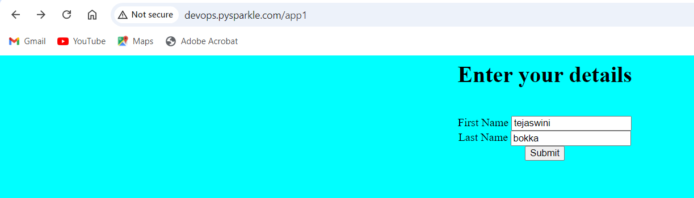
  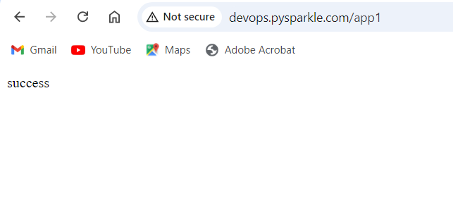

* Now check the database if the details are fetched or not.
  
  [preview](images/linux70.png)

* Now do the same process in VM-02.
